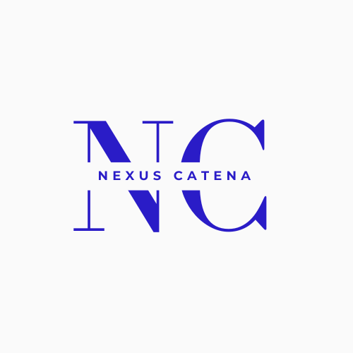

# NexCat - Blockchain Document Management System



NexCat is a decentralized document management system that leverages blockchain technology and IPFS (InterPlanetary File System) to provide secure, tamper-proof document storage, verification, and sharing.


## Features

- **Secure Document Storage**: Store documents on IPFS with encryption
- **Blockchain Verification**: Verify document authenticity using blockchain
- **Document Sharing**: Securely share documents with specific users
- **Tamper-Proof**: Ensure documents haven't been modified since upload
- **Timestamping**: All documents are timestamped on the blockchain
- **User Management**: Control access to your documents

## Technologies Used

- **Frontend**: React.js, Next.js, Tailwind CSS
- **Blockchain**: Ethereum, Web3.js
- **Storage**: IPFS (InterPlanetary File System)
- **Authentication**: MetaMask wallet integration

## Getting Started

### Prerequisites

- Node.js (v14 or higher)
- MetaMask browser extension
- Yarn or npm

### Installation

1. Clone the repository:
   ```bash
   git clone https://github.com/yourusername/NexCat.git
   cd NexCat

# NexusCatena
